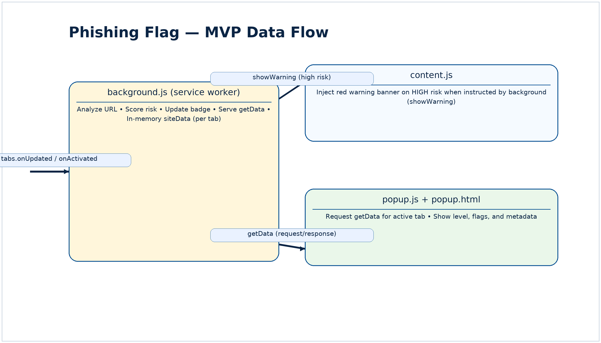

# Phishing Flag — MVP Architecture (Phase II)

## Overview
This MVP analyzes the active tab in a Chrome Manifest V3 extension and surfaces risk in three layers: badge (✓/!/⚠), popup details, and a red warning banner for high-risk pages. The **background service worker** is the brain: it listens to tab events (`chrome.tabs.onUpdated` and `onActivated`), runs `analyzeSite(url, tabId)`, computes a `score` and `level`, updates the badge, and serves data to the popup via a message handler. When `level === "high"`, it sends `{ action: "showWarning", data: risk }` to the **content script** to inject the banner. The **popup** sends `{ action: "getData" }` to the background and renders the returned object. All state is held **in-memory** in a `siteData` object keyed by `tabId` (no `chrome.storage` in MVP).

## Diagram


## Components & responsibilities
- **background.js (service worker)**
  - Listens for tab events; calls `analyzeSite(url, tabId)`
  - Computes risk `score` and `level` (low/medium/high)
  - Updates badge via `chrome.action.setBadgeText` and `setBadgeBackgroundColor`
  - Handles `chrome.runtime.onMessage` — responds to `{ action: "getData" }` with `siteData[tabId]`
  - Sends `{ action: "showWarning", data: risk }` to the content script when `level === "high"`
  - Maintains `siteData[tabId]` (cleared/refreshed on navigation)
- **content.js (content script)**
  - Listens for `{ action: "showWarning" }`
  - Injects a dismissible red banner at the top of the page
- **popup.js / popup.html**
  - Gets the active tab id; sends `{ action: "getData" }` to background
  - Renders level, flags, and metadata (domain, SSL grade, PhishTank status)

## Message contracts
**Popup → Background (request)**
```json
{{
  "action": "getData",
  "tabId": 123
}}
```

**Background → Popup (response)**
```json
{{
  "url": "https://example.com",
  "level": "medium",
  "score": 35,
  "flags": ["No HTTPS", "Suspicious TLD"],
  "metadata": {{ "domain": "example.top", "ssl_grade": "B", "phishtank": "Confirmed" }}
}}
```

**Background → Content (high risk only)**
```json
{{
  "action": "showWarning",
  "data": {{ "level": "high", "score": 60, "flags": ["PhishTank confirmed"], "url": "http://..." }}
}}
```

## Design choices (why this way)
- **Single orchestration point** in the service worker keeps everything consistent and testable.
- **Badge → popup → banner** layers minimize noise while keeping critical warnings unmissable.
- **No persistent storage** in MVP: lowest friction, better privacy, fewer bugs.
- **API lookups** (PhishTank / SSL Labs) add real-world signal beyond simple heuristics; Phase III can move them behind a small backend for caching/rate limits.

## Verification checklist (matches repo)
- Tab event wiring present (`onUpdated`, `onActivated`) → background updates badge.
- `analyzeSite(url, tabId)` computes `score`/`level` and stores result in `siteData[tabId]`.
- Popup sends `{ action: "getData" }` and renders returned object.
- Background sends `{ action: "showWarning" }` → content injects banner on **high** risk.
- No use of `chrome.storage` in MVP.
